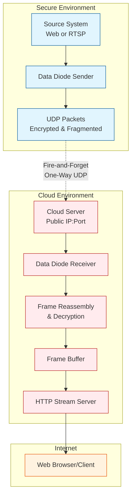

<p align="center">

</p>

## Soft Data Diode Video Streaming System 

A secure, one-way video streaming solution that implements a software-based data diode for transmitting web content and RTSP streams to a cloud server without exposing any return path.

This protects the secure service in two ways: it acts as a data diode, never establishing a 2-way communication link, and it also acts as an opto-isolator, transforming any web content into an image to prevent HTML inspection or other unintentional information leakage.

Even if the receiver cloud server is compromised, there should be no way to move laterally back into the sender's network if the receiver software is all that is installed.

The data itself is encrypted with AES-256-GCM prior to being transmitted with a simple pre-shared key.

## Architecture



## Features

- **True One-Way Communication**: No return path possible (software data diode)
- **Opto-Isolation**: Resource is encoded as a simple image to prevent information leakage
- **Multiple Stream Support**: Multi-receiver version handles multiple independent streams
- **Secure Encryption**: AES-256-GCM encryption with pre-shared keys
- **Web & RTSP Sources**: Capture web pages (with Selenium) or RTSP video streams

## Requirements

### Sender Side
```bash
pip install opencv-python-headless cryptography selenium numpy
```

### Receiver Side
```bash
pip install opencv-python-headless cryptography numpy
```

## Installation

1. **Clone the repository:**
```bash
git clone https://github.com/bmtwl/SoftDataDiode.git
cd SoftDataDiode
```

2. **Generate encryption key (must be same key on both sender and receiver sides) :**
```bash
python -c "from cryptography.fernet import Fernet; print(Fernet.generate_key().decode())"
```

## Configuration

### 1. Multi-receiver Configuration (`config.json`)

```json
{
  "server": {
    "http_host": "127.0.0.1",
    "http_port": 8000,
    "debug": false
  },
  "streams": {
    "dashboard": {
      "name": "Main Dashboard",
      "description": "Primary monitoring dashboard",
      "udp_host": "0.0.0.0",
      "udp_port": 5005,
      "key": "your-generated-key-here",
      "buffer_size": 100
    },
    "camera1": {
      "name": "Security Camera 1",
      "description": "Front entrance camera",
      "udp_host": "0.0.0.0",
      "udp_port": 5006,
      "key": "your-generated-key-here",
      "buffer_size": 100
    }
  }
}
```

### 2. Example Web Frontend Configuration (Caddy)

_While of course you can use any web front end you want (Apache, Nginx, Traefik, etc), or even expose the builtin web service directly, Caddy is shown here for simplicity._

#### Add an HTTP basic auth gate by adding a username and hashed password:
```bash
caddy hash-password --plaintext "mysecret"
```

#### Edit Caddy Config eg `/etc/caddy/Caddyfile`
```caddyfile
yourservername {
    tls internal
    basicauth {
        user output-of-caddy-hash-password
    }
    handle {
        reverse_proxy 127.0.0.1:8000
    }
}
```

## Usage

### Running Senders

#### Web Page Capture
```bash
python ddsender.py \
  --mode web \
  --source "https://webpage.example.com" \
  --cloud-ip YOUR_CLOUD_IP \
  --cloud-port 5005 \
  --key "your-base64-key-here" \
  --interval 5
```

#### RTSP Stream Capture
```bash
python ddsender.py \
  --mode rtsp \
  --source "rtsp://camera.example.com/stream" \
  --cloud-ip YOUR_CLOUD_IP \
  --cloud-port 5006 \
  --key "your-base64-key-here" \
  --interval 0.1
```

### Running the Receiver

```bash
# Single receiver usage
python ddreceiver.py \
  -udp-host 1.2.3.4 \
  --udp-port 5005 \
  --http-host 127.0.0.1 \
  --http-port 8000 \
  --key "your-base64-key-here"

# Multi-receiver usage
python ddmultireceiver.py --config /path/to/config.json
```
