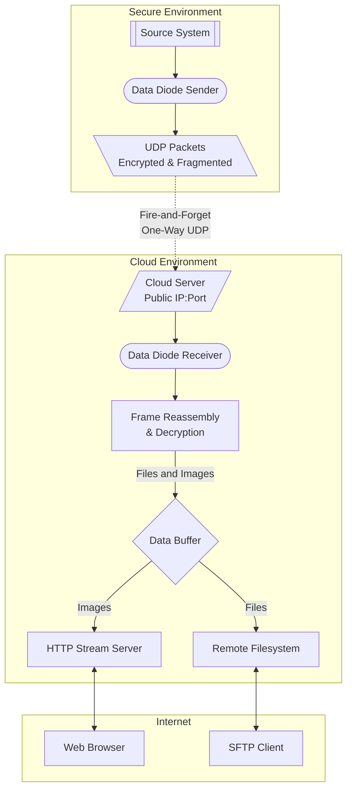

## Soft <ins title='Yes, without a hardware component this is technically a "Unidirectional Application Gateway", however since this software all still works in conjunction with a physical unidirectional airgap I think "Soft Data Diode Tools" is still defensibly accurate. Besides, it sounds cooler : )'>Data Diode</ins> Tools 

A secure, one-way data streaming solution that implements a software-based data diode for transmitting web content, RTSP streams, VNC sessions and files from a secure network zone (eg. your intranet) to another network (eg. the cloud) without exposing any return path. 

<p align="center">


</p>

Pairs well with its [eBPF companion project](https://github.com/bmtwl/udp-ebpf-monitor)

## Overview

This system provides application-level unidirectionality by design - the sender never binds to listening ports. Combined with network-level controls, it creates a one-way data path that prevents lateral movement even if the receiver is compromised.

**Key Features:**
- **Application-Level One-Way Communication**: Sender never listens for return traffic
- **Opto-Isolation**: Web and VNC content transformed into static images
- **Multiple Stream Support**: Handle multiple independent streams simultaneously
- **Secure Encryption**: AES-256-GCM with pre-shared keys
- **Multiple Data Sources**: Web pages, RTSP streams, VNC sessions, and file synchronization
- **Image Freshness Monitoring**: Visual and programmatic status indicators

For detailed security considerations and deployment scenarios, see the [wiki](https://github.com/bmtwl/SoftDataDiode/wiki).

## Quick Start

### Installation

**On both Sender and Receiver sides:**
```bash
cd /opt
git clone https://github.com/bmtwl/SoftDataDiode.git
cd SoftDataDiode
python -m venv venv
source venv/bin/activate
```

**Sender Side:**
```bash
pip install opencv-python-headless cryptography selenium numpy
```

**Receiver Side:**
```bash
pip install Pillow cryptography
```

Generate an encryption key (must be identical on both sides):
```bash
python -c "from cryptography.fernet import Fernet; print(Fernet.generate_key().decode())"
```

### Basic Usage

**Web Page Capture:**
```bash
python sender/ddsender.py \
  --mode web \
  --source "https://webpage.example.com" \
  --cloud-ip YOUR_CLOUD_IP \
  --cloud-port 5005 \
  --key "your-base64-key-here" \
  --interval 5
```

**RTSP Stream Capture:**
```bash
python sender/ddsender.py \
  --mode rtsp \
  --source "rtsp://camera.example.com/stream" \
  --cloud-ip YOUR_CLOUD_IP \
  --cloud-port 5006 \
  --key "your-base64-key-here" \
  --interval 0.1
```

**VNC Capture (needs `vncsnapshot` binary in path):**
```bash
python sender/ddsender.py \
  --mode vnc \
  --source "vnc.example.com" \
  --cloud-ip YOUR_CLOUD_IP \
  --cloud-port 5006 \
  --password ~/.vnc/passwd \
  --key "your-base64-key-here" \
  --interval 10
```

**File Sync:**
```bash
python sender/ddsender.py \
  --mode filesync \
  --sync-path /home/user/documents \
  --cloud-ip YOUR_CLOUD_IP \
  --cloud-port 5010 \
  --key "your-base64-key-here" \
  --sync-interval 60 \
  --max-file-age 1 
```

**Simple Image Receiver:**
```bash
# Single image stream receiver usage
python receiver/ddreceiver.py \
  -udp-host RECEIVER_LISTEN_IP \
  --udp-port 5005 \
  --http-host 127.0.0.1 \
  --http-port 8000 \
  --key "your-base64-key-here"
```

**Multi-Receiver, file receiver, etc:**

See the [Configuration](https://github.com/bmtwl/SoftDataDiode/wiki/Configuration) wiki page for detailed configuration options.

## Architecture overview



For detailed architecture information, see the [Architecture](https://github.com/bmtwl/SoftDataDiode/wiki/Architecture) wiki page.

## Security Model

This system implements a defense-in-depth approach:

1. **Application-level unidirectionality** - sender never binds to listening ports
2. **Network-level blocking** - firewall rules and ACLs prevent return traffic  
3. **Infrastructure-level detection** - logging and alerting on suspicious attempts

>[!important]
>This is a software-based solution, not a hardware data diode. While it provides strong protections, it requires proper configuration and hardening. See [Security Model and Hardening](https://github.com/bmtwl/SoftDataDiode/wiki/Security-Model-and-Hardening) for detailed security considerations.

## Web Frontend

The built-in HTTP server is designed to run behind a reverse proxy.

#### Add an HTTP basic auth gate by adding a username and hashed password:
```bash
caddy hash-password --plaintext "mysecret"
```

### Example Caddy configuration:
```caddyfile
yourserverfqdn {
    tls internal
    basic_auth {
        user <hashed-password>
    }
    handle {
        reverse_proxy 127.0.0.1:8000
    }
}
```

See the [Configuration](https://github.com/bmtwl/SoftDataDiode/wiki/Configuration) wiki page for more web server examples.

## Documentation

- [Installation Guide](https://github.com/bmtwl/SoftDataDiode/wiki/Install) - Detailed installation instructions
- [Configuration Reference](https://github.com/bmtwl/SoftDataDiode/wiki/Configuration) - Complete configuration options
- [Security Model and Hardening](https://github.com/bmtwl/SoftDataDiode/wiki/Security-Model-and-Hardening) - Security considerations and hardening procedures
- [Deployment Scenarios](https://github.com/bmtwl/SoftDataDiode/wiki/Deployment-Scenarios) - Various deployment patterns
- [Troubleshooting Guide](https://github.com/bmtwl/SoftDataDiode/wiki/Troubleshooting-Guide) - Common issues and solutions
- [Testing and Verification](https://github.com/bmtwl/SoftDataDiode/wiki/Testing-and-Verification) - Testing your deployment

## Other Important Things

>[!Caution]
>This system differs from a pure hardware Data Diode in that all parts of the system are implemented in software. Certified Hardware Data Diodes are expensive for a reason! The tradeoff is that the savings come with a need to vet the configuration in order to guarantee correctness.

If you are looking for an actual hardware data-diode, there are inexpensive ways to get there:
- https://datadiode.net/hardware/
- https://github.com/mitcdh/diode-switch-config
- https://github.com/wavestone-cdt/dyode

Any of these projects can be used in conjunction with the tools in this repo to create a true physical unidirectionality interlock.

## Troubleshooting

For common issues including Selenium setup, performance tuning, and network debugging, see the [Troubleshooting Guide](https://github.com/bmtwl/SoftDataDiode/wiki/Troubleshooting-Guide).
