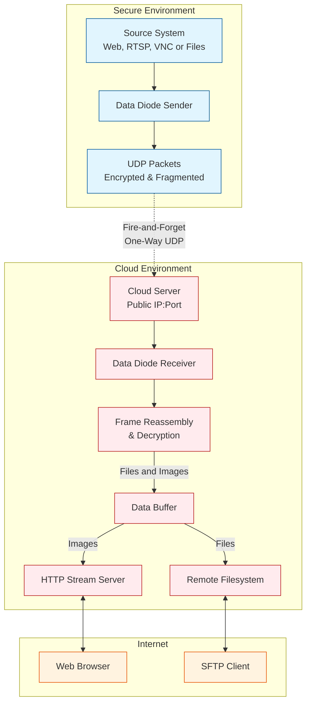

<p align="center">

</p>

## Soft Data Diode Streaming System 

A secure, one-way data streaming solution that implements a software-based data diode for transmitting web content, RTSP streams, vnc sessions and files to a cloud server without exposing any return path.

This protects the secure service in two ways: it acts as a data diode, never establishing a 2-way communication link, and for web and vnc it also acts as an opto-isolator, transforming that content into a static image to prevent interaction, HTML inspection or other unintentional information leakage.

Even if the receiver cloud server is compromised, there should be no way to move laterally back into the sender's network if the receiver software is all that is installed and appropriate mitigations are in line in the secure network.

The data itself is encrypted with AES-256-GCM prior to being transmitted with a simple pre-shared key.

This system differs from a hardware Data Diode in that all parts of the system are implemented in software in order to achieve the same goal at zero cost. This means that there is no physical "air gap" like a true diode would provide, and the savings come with a need to vet the configuration in order to guarantee correctness. A defence-in-depth approach is discussed below in the "Security Considerations" section.


## Architecture



## Features

- **True One-Way Communication**: No return path possible given correct implementation (software data diode)
- **Opto-Isolation**: Resource is encoded as a simple image to prevent information leakage
- **Multiple Stream Support**: Multi-receiver version handles multiple independent streams
- **Secure Encryption**: AES-256-GCM encryption with pre-shared keys
- **Web, RTSP and VNC Image Sources**: Capture web pages (with Selenium), RTSP video streams or VNC clients (with vncsnapshot)
- **Filesystem Replication**: Best-effort file replication with automatic sliding window to allow opportunities for successful transfer
- **Image Freshness Monitoring**: Image streams visually and programatically show whether updates are:
    - Live - Green dot (Updated within the last 30 seconds)
    - Stalled - Yellow dot and time since last frame (Last update was more than 30 seconds ago)
    - Stale - Red dot (Not updated in more than 5 minutes)
    - Freshness JSON endpoint per stream with the state and seconds since last frame (`https://host/stream/freshness`)

## Security Considerations

Due to the way that modern, stateful firewalls work, there is the possibility that an attacker that has taken control of the "Cloud Server" could abuse incoming UDP connections to send traffic back into the secure network. This is further compounded by the fact that the Internet, as it was designed will attempt to route around blocks in order to deliver traffic.

There are a number of mitigations possible:

   - Firewall rules attempting to prevent return traffic will generally not work. The packet will be part of an established flow and hit the fast-path before any rules are evaluated. YMMV with your specific firewall platform, and software firewalls may be more ammenable to setting up rules to block right at the front door to your network (see below).
   - Firewalls that support SNAT may be configured with a return address to something like 192.0.2.x (often used as a blackhole address)
   - Switch ACLs at a choke point that prevent return UDP traffic
   - OS level firewalls can be used to attempt to block specific types of traffic. Linux iptables is flexible enough to do exactly what we want (statefully deny return traffic)

These mitigations can generally "stack", allowing a defence in depth approach that approaches a guarantee of security.

Known mitigation techniques are documented in the "Hardening" section below. Scripts are included in the repository to test for potential misconfiguration.

## Installation

1. **Clone the repository:**
```bash
cd /opt
git clone https://github.com/bmtwl/SoftDataDiode.git
cd SoftDataDiode
```
2. **Create a virtual environment (optional):**

   _A `venv` is recommended for the sender side especially, as selenium can be famously hard to get to work using OS packages._

   _If you use a `venv` then you must activate it before starting any senders or receivers. To exit a `venv`, use the `deactivate` command._

```bash
python -m venv venv
source venv/bin/activate
```

3. **Install Packages:**

   **Sender Side:**
   ```bash
   pip install opencv-python-headless cryptography selenium numpy
   ```

   **Receiver Side:**
   ```bash
   pip install opencv-python-headless cryptography numpy
   ```

4. **Generate encryption key (must be same key on both sender and receiver sides) :**
```bash
python -c "from cryptography.fernet import Fernet; print(Fernet.generate_key().decode())"
```

## Configuration

### 1. Multi-receiver Configuration (`config.json`)

```json
{
  "server": {
    "http_host": "127.0.0.1",
    "http_port": 8000,
    "html_title": "Data Diode Streams",
    "debug": false
  },
  "streams": {
    "dashboard": {
      "name": "Main Dashboard",
      "description": "Primary monitoring dashboard",
      "udp_host": "0.0.0.0",
      "udp_port": 5005,
      "key": "your-generated-key-here",
      "buffer_size": 5
    },
    "camera1": {
      "name": "Security Camera 1",
      "description": "Front entrance camera",
      "udp_host": "0.0.0.0",
      "udp_port": 5006,
      "key": "your-generated-key-here",
      "buffer_size": 5,
      "display_resolution": "1280x720"
    },
    "desktop1": {
      "name": "Desktop 1",
      "description": "Information Kiosk desktop",
      "udp_host": "0.0.0.0",
      "udp_port": 5007,
      "key": "your-generated-key-here",
      "buffer_size": 5
    }
  }
}
```

### 2. Example Web Frontend Configuration (Caddy)

While of course you can use any web front end you want (Apache, Nginx, Traefik, etc), or even expose the builtin web service directly, Caddy is shown here for simplicity.

#### Add an HTTP basic auth gate by adding a username and hashed password:
```bash
caddy hash-password --plaintext "mysecret"
```

#### Edit Caddy Config eg `/etc/caddy/Caddyfile`
```caddyfile
yourserverfqdn {
    tls internal
    basic_auth {
        user output-of-caddy-hash-password
    }
    handle {
        reverse_proxy 127.0.0.1:8000
    }
}
```

_Remove the `tls internal` line if your domain is public and you want to have an [automatic LetsEncrypt certificate](https://caddyserver.com/docs/automatic-https#overview) generated for this host._

_Remove the `basic_auth` (`basicauth` prior to v2.8) section if you want to allow access without any authentication._

## Usage

### Running Senders

#### Web Page Capture
```bash
python sender/ddsender.py \
  --mode web \
  --source "https://webpage.example.com" \
  --cloud-ip YOUR_CLOUD_IP \
  --cloud-port 5005 \
  --key "your-base64-key-here" \
  --interval 5
```

#### RTSP Stream Capture
```bash
python sender/ddsender.py \
  --mode rtsp \
  --source "rtsp://camera.example.com/stream" \
  --cloud-ip YOUR_CLOUD_IP \
  --cloud-port 5006 \
  --key "your-base64-key-here" \
  --interval 0.1
```

#### VNC Capture
```bash
python sender/ddsender.py \
  --mode vnc \
  --source "vnc.example.com" \
  --cloud-ip YOUR_CLOUD_IP \
  --cloud-port 5006 \
  --password ~/.vnc/passwd \
  --key "your-base64-key-here" \
  --interval 10
```

### File Sync
```bash
python sender/ddsender.py \
  --mode filesync \
  --sync-path /home/user/documents \
  --cloud-ip YOUR_CLOUD_IP \
  --cloud-port 5010 \
  --key "your-base64-key-here" \
  --sync-interval 60 \
  --max-file-age 1 
```

### Running the Receiver

```bash
# Single receiver usage
python receiver/ddreceiver.py \
  -udp-host 1.2.3.4 \
  --udp-port 5005 \
  --http-host 127.0.0.1 \
  --http-port 8000 \
  --key "your-base64-key-here"

# Multi-receiver usage
python multireceiver/ddmultireceiver.py --config /path/to/config.json

# Filesync receiver usage
python filereceiver/ddfilereceiver.py \
    --udp-host 1.2.3.4 \
    --udp-port 5010 \
    --http-host 127.0.0.1 \
    --http-port 8080 \
    --key "your-base64-key-here" \
    --output-dir /path/to/filesync 
```

## Hardening
Since this process relies on the behaviour of many systems between the sender and receiver, it is recommended that the path be hardened at as many points as possible. 
The below list includes both general techniques and ideas, but also specific implementation information.

_The information in this section is mostly limited to procedures specific to this software. For general hardening best-practices like automatic updates, zero trust style least privlege, etc, see vendor documentation_

### Hardware Firewall
#### Source/destination/protocol/port rules
Modern firewalls are stateful, and are architected in a way that will actively fight with attempts to block established sessions using traditional firewall rules. 
You may have more luck, but its safe to assume most will be impossible to harden in this way.
#### Source-NAT rules
SNAT is a common firewall feature that lets you control return path of packets for a number of common scenarios, but we can exploit it for our uncommon purposes. 
Basically the sender's packets leaves the firewall with a dummy source IP, which is the IP that the cloud server will try to respond to. 
As long as this can be configured to a non-functional or blackhole style address (192.0.2.0/24 is traditional), then the return path will be fundamentally broken outside the network's perimiter.
#### Next-Gen Firewall protocol inspection
If all else fails, your NGFW will hopefully notice that the return packets are malformed and will log, block and drop malicious packets. Best not to rely on this, as attackers could be using valid protocol streams.
Still, any extra protection that you can turn on in your firewall will make it that much harder to exploit.

### Network Switches
#### Access Control Lists
Switch ACLs that operate at Layer 3 should be able to block arbitrary traffic, with no relation to established sessions or flows.

### Software, OS or XDR agent Firewalls
#### Linux 
iptables can be set up in exactly the way we want:

Optionally start by logging blocks (needs to be first or the packet will be dropped before being logged):

    iptables -A INPUT -p udp -s 1.2.3.4 --sport 5005:5020 -m state --state ESTABLISHED,RELATED -j LOG --log-prefix "IPTABLES DROP: " --log-level 7
    
Then create the actual rule:

    iptables -A INPUT -p udp -s 1.2.3.4 --sport 5005:5020 -m state --state ESTABLISHED,RELATED -j DROP
    
This will track the session state for the outgoing packets to your cloud server (1.2.3.4) and drop anything returning from this session. Perfect!

As cool as that is, we can probably just drop _all_ traffic returning from the cloud server:

    iptables -A INPUT --source 1.2.3.4 -j DROP

#### Others
Windows (and other host firewalls) may be able to do something similar by positioning the return block rule at the top of the ruleset, but this requires further investigation.
These will need to be verified and documented system-by-system.

#### Testing your Hardened Infrastruture
The "Hardening" folder in this repository includes scripts to test the ability of your infrastructure to repel attempts to backpropagate into the secure network.

## Troubleshooting

### Selenium crashes because it can't find a chrome/chromium driver
There are broken OS packages on Debian, at least. The recommended way to run the sender is with a `venv`.

### Resource usage is too high
There are a few strategies to reduce resource usage:
1. Reduce the capture resolution of the image that is being sent/received.
2. Increase the interval between captures
3. Reduce the jpeg quality (This may make text hard to read. The default of `60` is already a good balance of quality vs size)
4. Switch from Python to Pypy (hard)

### Traffic isn't getting through to the receiver
Check for the presence of UDP packets using something like Wireshark or `tcpdump udp and port 5005`. You should see a constant stream from the sender to the receiver on both hosts.
Any firewalls in the path between the sender and receiver are highly likely to block this traffic, so make sure they are set up with appropriate allow rules.

### Not all my files are coming through during file sync
Dotfiles are skipped by default, but can be turned on with a flag on the sender.
There is no guarantee that any given file will get through during a round of syncing, or that the receiver is even listening!
The best bet is to increase your `--max-file-age` and shorten your `--sync-interval` until you are getting the level of synchronization success that you need.
You may also want to schedule a regular run with `--max-file-age 0` in order to try to get any straggler files that didn't make it over in any other sync.

### Things aren't working and I'm not sure what's happening
You can start the sender or receiver with the `--debug` flag, or turn on debugging in the `config.json` file. This should make the output very verbose.
If this still doesn't help, please create an issue in the repo.

## Known issues

### My logs have lots of `I/O operation on closed file` events in them
This is due to the way the Python http server flushes out connections and there is no simple workaround.
I may do some custom exception handling in the future to clean these up, but for now they can be safely ignored.

### Very large files don't come through consistently
If you are trying to transfer very large files, a single packet being lost or corrupted during transmission will cause the receiver to throw the whole thing away.
You can increase the number of attempts to have a better chance of success, or increase the MTU and `--max-packet-size` to help make things better, but the short answer is that this is an inherently unreliable method of transfer, and large files are a worst case.
