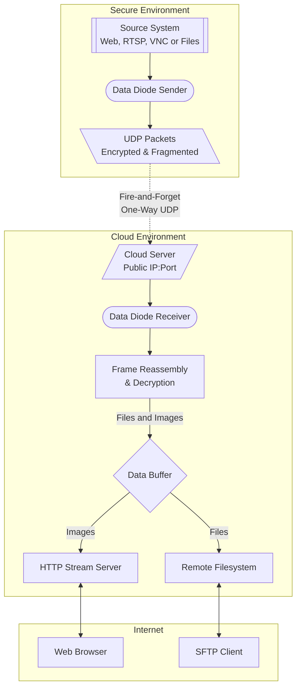

<p align="center">


</p>

## Internet Edge Soft <ins title='Yes, without a hardware component this is technically a "Unidirectional Application Gateway", however since this software all still works in conjunction with a unidrectional airgap I think "Soft Data Diode Tools" is still defensibly accurate.'>Data Diode</ins> Streaming Tools 

A secure, one-way data streaming solution that implements a software-based data diode for transmitting web content, RTSP streams, vnc sessions and files from a secure network zone (eg. your intranet) to another network (eg. the cloud) without exposing any return path.

The development of these tools was prompted by a need to safely share internal resources with an external party without exposing any of the internal network to potential attack or compromise. It differs from other data-diode solutions in that it isn't intended to pass through an actual air-gap, but through the implied air-gap of an network edge firewall. In short, a desire to reduce the exploitable surface are of an internal network by eliminating services that had been running in a DMZ.

This protects the secure service in two ways: it acts as a data diode, never establishing a 2-way communication link, and for web and vnc it also acts as an opto-isolator, transforming that content into a static image to prevent interaction, HTML inspection or other unintentional information leakage or external control.

Even if the receiver server is compromised, there should be no way to move laterally back into the sender's network. This is double-true if appropriate mitigations have been implemented as-per instructions.

The data itself is encrypted with AES-256-GCM prior to being transmitted with a simple pre-shared key.

>[!IMPORTANT]
>This system differs from a pure hardware Data Diode in that all parts of the system are implemented in software in order to achieve the same goal at zero cost. This means that there is no physical "air gap" like a true unidirectional diode/opto-isolator would provide. Certified Hardware Data Diodes are expensive for a reason! The tradeoff is that the savings come with a need to vet the configuration in order to guarantee correctness. A defence-in-depth approach is discussed below in the [Security Considerations](#security-considerations) and [Hardening](#hardening) sections.
>The security model relies on:
>- Application-level unidirectionality (sender never binds to listening ports)
>- Network-level blocking (firewall rules and ACLs prevent return traffic)
>- Infrastructure-level detection (logging and alerting on suspicious attempts)
>
>If you are looking for an actual hardware data-diode, there are inexpensive ways to get there:
>- https://datadiode.net/hardware/
>- https://github.com/mitcdh/diode-switch-config
>- https://github.com/wavestone-cdt/dyode
>
>Any of these projects can be used in conjunction with the tools in this repo to create a true physical unidirectionality interlock.

## Architecture



## Features

- **Application-Level One-Way Communication**: Sender never binds to listening ports. No return path possible given correct implementation
- **Opto-Isolation**: Resource is encoded as a simple image to prevent information leakage
- **Multiple Stream Support**: Multi-receiver version handles multiple independent streams
- **Secure Encryption**: AES-256-GCM encryption with pre-shared keys
- **Web, RTSP and VNC Image Sources**: Capture web pages (with Selenium), RTSP video streams or VNC clients (with vncsnapshot)
- **Filesystem Replication**: Best-effort file replication with automatic sliding window to allow opportunities for successful transfer
- **Image Freshness Monitoring**: Image streams visually and programatically show whether updates are:
    - Live - Green dot (Updated within the last 30 seconds)
    - Stalled - Yellow dot and time since last frame (Last update was more than 30 seconds ago)
    - Stale - Red dot (Not updated in more than 5 minutes)
    - Freshness JSON endpoint per stream with the state and seconds since last frame (`https://host/stream/freshness`)

## Installation

2. **Clone the repository:**
```bash
cd /opt
git clone https://github.com/bmtwl/SoftDataDiode.git
cd SoftDataDiode
```
2. **Create a virtual environment (optional):**

>[!TIP]
>A `venv` is recommended for the sender side especially, as selenium can be famously hard to get to work using OS packages.
>
>If you use a `venv` then you must activate it before starting any senders or receivers. To exit a `venv`, use the `deactivate` command.

```bash
python -m venv venv
source venv/bin/activate
```

3. **Install Packages:**

   **Sender Side:**
   ```bash
   pip install opencv-python-headless cryptography selenium numpy
   ```
>[!IMPORTANT]
>You will also need a browser and webdriver installed for Selenium to work, even on a headless OS.

   **Receiver Side:**
   ```bash
   pip install Pillow cryptography
   ```

4. **Generate encryption key (must be same key on both sender and receiver sides) :**
```bash
python -c "from cryptography.fernet import Fernet; print(Fernet.generate_key().decode())"
```

## Configuration

### 1. Multi-receiver Configuration (`config.json`)

```json
{
  "server": {
    "http_host": "127.0.0.1",
    "http_port": 8000,
    "html_title": "Data Diode Streams",
    "debug": false
  },
  "streams": {
    "dashboard": {
      "name": "Main Dashboard",
      "description": "Primary monitoring dashboard",
      "udp_host": "0.0.0.0",
      "udp_port": 5005,
      "key": "your-generated-key-here",
      "buffer_size": 2
    },
    "camera1": {
      "name": "Security Camera 1",
      "description": "Front entrance camera",
      "udp_host": "0.0.0.0",
      "udp_port": 5006,
      "key": "your-generated-key-here",
      "buffer_size": 2,
      "display_resolution": "1280x720"
    },
    "desktop1": {
      "name": "Desktop 1",
      "description": "Information Kiosk desktop",
      "udp_host": "0.0.0.0",
      "udp_port": 5007,
      "key": "your-generated-key-here",
      "buffer_size": 2
    }
  }
}
```

### 2. Example Web Frontend Configuration (Caddy)

While of course you can use any web front end you want (Apache, Nginx, Traefik, etc), or even expose the builtin web service directly, Caddy is shown here for simplicity.

#### Add an HTTP basic auth gate by adding a username and hashed password:
```bash
caddy hash-password --plaintext "mysecret"
```

#### Edit Caddy Config eg `/etc/caddy/Caddyfile`
```caddyfile
yourserverfqdn {
    tls internal
    basic_auth {
        user output-of-caddy-hash-password
    }
    handle {
        reverse_proxy 127.0.0.1:8000
    }
}
```

>[!TIP]
>Remove the `tls internal` line if your domain is public and you want to have an [automatic LetsEncrypt certificate](https://caddyserver.com/docs/automatic-https#overview) generated for this host.
>
>Remove the `basic_auth` (`basicauth` prior to v2.8) section if you want to allow access without any authentication.

## Usage

### Running Senders

#### Web Page Capture
```bash
python sender/ddsender.py \
  --mode web \
  --source "https://webpage.example.com" \
  --cloud-ip YOUR_CLOUD_IP \
  --cloud-port 5005 \
  --key "your-base64-key-here" \
  --interval 5
```

#### RTSP Stream Capture
```bash
python sender/ddsender.py \
  --mode rtsp \
  --source "rtsp://camera.example.com/stream" \
  --cloud-ip YOUR_CLOUD_IP \
  --cloud-port 5006 \
  --key "your-base64-key-here" \
  --interval 0.1
```

#### VNC Capture
```bash
python sender/ddsender.py \
  --mode vnc \
  --source "vnc.example.com" \
  --cloud-ip YOUR_CLOUD_IP \
  --cloud-port 5006 \
  --password ~/.vnc/passwd \
  --key "your-base64-key-here" \
  --interval 10
```

### File Sync
```bash
python sender/ddsender.py \
  --mode filesync \
  --sync-path /home/user/documents \
  --cloud-ip YOUR_CLOUD_IP \
  --cloud-port 5010 \
  --key "your-base64-key-here" \
  --sync-interval 60 \
  --max-file-age 1 
```

### Sender Config File
```bash
python sender/ddsender.py --config  /path/to/sender_config.json
```
>[!TIP]
>See `sender` folder for JSON config examples

### Running the Receiver

```bash
# Single image stream receiver usage
python receiver/ddreceiver.py \
  -udp-host 1.2.3.4 \
  --udp-port 5005 \
  --http-host 127.0.0.1 \
  --http-port 8000 \
  --key "your-base64-key-here"

# Image Multi-receiver usage
python multireceiver/ddmultireceiver.py --config /path/to/receiver_config.json

>[!TIP]
>See `multireceiver` folder for JSON config examples

# Filesync receiver usage
python filereceiver/ddfilereceiver.py \
    --udp-host 1.2.3.4 \
    --udp-port 5010 \
    --http-host 127.0.0.1 \
    --http-port 8080 \
    --key "your-base64-key-here" \
    --output-dir /path/to/filesync 
```
### Running as an OS Service
This will be highly specific to your Operating System.

There is an example of a systemd service definition for the multireceiver in the hardening folder in this repo. You should adapt it to your needs, especially the read-write paths and resource limits section. e.g. the example file has cpu usage capped at 5%, which is in the sustainable limits of most VPS services, but which may not be enough for full production.

In general, having a separation of duties by creating service accounts without interactive login rights for each service is recommended. Locking these accounts down to the smallest set of network/filesystem/etc privileges possible is also recommended.

## Security Considerations

Due to the way that modern, stateful firewalls work, there is the possibility that an attacker that has taken control of the "Cloud Server" could abuse incoming UDP connections to send traffic back into the secure network. This is further compounded by the fact that the Internet, as it was designed, will attempt to route around blocks in order to deliver traffic.

>[!NOTE]
>This system is designed to be reasonably secure by default, but you should know your risk profile and manage it appropriately. This can be a major rabbit hole if you decide to be "as secure as possible".

There are a number of mitigations possible:

   - Firewalls that support SNAT may be configured with a return address of something like 192.0.2.x (often used as a blackhole address) or an unused internal address as a canary
   - Switch ACLs to prevent these specific return UDP traffic flows may be created at a choke point
   - OS level firewalls may be used to attempt to block specific types of traffic. Linux iptables is flexible enough to do exactly what we want (statefully deny return traffic)
   - Use a [packet forwarder](https://github.com/bmtwl/udp-ebpf-monitor) that mangles the packets and breaks return state

These mitigations can generally "stack", allowing a defence in depth approach that approaches a guarantee of security.

>[!NOTE]
>You might think that block rules on your hardware firewall preventing return traffic would be a possible mitigation, but contrary to intuition these will generally not work. The packet will be part of an established flow and hit the fast-path before any rules are evaluated. YMMV with your specific firewall platform, but be prepared for disappointment.

All this said, if the sender is behind a NATting firewall then it is highly unlikely that the receiver would be practically able to send a packet back on a different port. The firewall would have chosen a random port to forward the traffic from, and if the receiver doesn't send the return packets to the same port, then it would be dropped. If the receiver _does_ send packets back to that same randomized port, then it is mapped back to the original port, where there is nothing listening if implemented as per this guide.

If the sender and receiver have a firewall between them but no form of NAT (ie. sender and receiver can route to each other with no address translation), then suddenly an attacker can choose arbitrary ports, and your job gets somewhat harder. This is also true of some kinds of NAT that map a host in a more sophisticated way, like symmetrical NAT or various cone NATs. STUN/TURN/ICE/NAT-PMP/PCP/UPnP or other dynamic NAT translation helper protocols or programs being in play may also make the situation more complex and require careful consideration. If the host is specified as the "DMZ" host, then it probably has only light protection and should be treated as fully exposed.

If there can be no hardware firewall in place at all or it is running in Layer 2 "bump-in-wire" mode, you can either try to use the `iptables` rule in the mitigations section to block at the OS level or risk-manage. Really, at that point you will not be able to build a data-diode in any real sense and have probably chosen the wrong tool.

Known mitigation techniques are documented in the "Hardening" section below. Scripts are included in the repository to test for potential misconfiguration.

>[!NOTE]
>Any return traffic attempting to reach the sender from the receiver is **provably malicious** and will be blocked by network controls. This creates clear security events that can be monitored and investigated.

## Hardening
Since this process relies on the behaviour of many systems between the sender and receiver, it is recommended that the path be hardened at as many points as possible. 
The below list includes both general techniques and ideas, but also specific implementation information.

>[!CAUTION]
>The information in this section is mostly limited to procedures specific to this software. For general hardening best-practices like automatic updates, zero trust style least privlege, etc, see vendor documentation

### Hardware Firewall
#### Source-NAT rules
SNAT is a common firewall feature that lets you control the return path of packets for a number of well-known scenarios, but we can exploit it for our uncommon purposes. 
Basically the sender's packets leave the firewall with a dummy source IP, which is the IP that a compromised cloud server would try to respond to. 
As long as this can be configured to a non-functional or blackhole style address (192.0.2.0/24 is traditional), then the return path will be fundamentally broken outside the network's perimiter. Substitute in a valid-but-unused address, and you have created a tripwire you can monitor and alert on.
#### Next-Gen Firewall protocol inspection
If all else fails, your NGFW will hopefully notice that the return packets are malformed and will log, block and drop malicious packets. Best not to rely on this, as attackers could be using valid protocol streams.
Still, any extra protection that you can turn on in your firewall will make it that much harder to exploit.
#### Source/destination/protocol/port rules
This is usually a dead end. Modern firewalls are stateful, and are architected in a way that will actively fight with attempts to block established sessions using traditional firewall rules. 
Its safe to assume most will be impossible to harden in this way.

### Network Switches
#### Access Control Lists
Switch ACLs that operate at Layer 3 should be able to block arbitrary traffic, with no relation to established sessions or flows.

Reference your switch vendors documentation for specific configuration procedures.

### Software, OS or XDR agent Firewalls
#### Linux iptables/nftables
iptables can be set up in exactly the way we want:

Optionally start by logging blocks. This is a valuable signal as this traffic should never happen outside of testing (needs to be first or the packet will be dropped before being logged):

```bash
iptables -A INPUT -p udp -s 1.2.3.4 --sport 5005:5020 -m state --state ESTABLISHED,RELATED -j LOG --log-prefix "BACKPROPAGATION DROP: " --log-level 7
```

Then create the actual rule:

```bash
iptables -A INPUT -p udp -s 1.2.3.4 --sport 5005:5020 -m state --state ESTABLISHED,RELATED -j DROP
```

This will track the session state for the outgoing packets to your cloud server (1.2.3.4) and drop anything returning from this session on the ports that the senders are using (between 5005 and 5020 in this example). Perfect!
Now that you have a tight rule to just catch the specfic traffic you're looking for, you can use a test script from the mitigations section below and watch the iptables counters with `iptables -v -n -L`. The counters should go up on the rule you specified if they're being caught. You can sanity check this with tcpdump or wireshark to see if _anything_ from the receiver is being seen on the sender side. As a side-note: tcpdump/libpcap sees packets before they hit the iptables firewall, so you may see the traffic even if its getting dropped, which is why looking at packet-counts for your rules is important.

In addition, we can probably just drop _all_ traffic returning from the cloud server in a final catchall rule:

```bash
iptables -A INPUT --source 1.2.3.4 -j LOG --log-prefix "BACKPROPAGATION DROP: " --log-level 7
iptables -A INPUT --source 1.2.3.4 -j DROP
```

#### Linux eBPF modules
You can use a [packet forwarder](https://github.com/bmtwl/udp-ebpf-monitor) to limit the service's ablity to talk to the general network, as well as mangle the packet in a way that breaks network state, making return traffic impossible.

#### Others
Windows (and other host/agent firewalls) may be able to do something similar by positioning the return block rule at the top of the ruleset, but this requires further investigation.
These will need to be verified and documented system-by-system.

>[!CAUTION]
>Be sure to harden your cloud server as much as possible!
>
>While we have been concentrating on ways in which we can prevent lateral movement, an attacker that gained access to the cloud server could also do nasty things like serve malware to users of the cloud server, use it as part of a botnet, use it as a spam host, mine crypto and many other things that you would not want to happen.

#### Testing your Hardened Infrastruture
The "hardening" folder in this repository includes scripts to test the ability of your infrastructure to repel attempts to backpropagate into the secure network.

The `ddreflect.py` is the simplest test. Before you have any mititgations in place, you may find that you are able to use it to return traffic.
As you implement mitigations, verify that you can see return traffic, and then put one mitigation in place. Verify that it blocks the return path before removing it and starting the process again for the next mitigation.
Once you have verified each mitigations in isolation, you should implement all mitigations for defence in depth against backpropagation of traffic from the receiver to the sender.

The `ddredirect.py` allows you to also specify the return UDP port, and can test for the precense of more sophisticated scenarios where an attacker is able to redirect to another port to attempt to exploit other services on the sender than just ones that live on the sending port.

### Security Monitoring
Monitor for these log signatures indicating potential compromise attempts:
- `SUSPICIOUS RETURN TRAFFIC` in system logs
- Blocked UDP packets from cloud server IPs
- Unexpected ICMP responses to sender

These events should trigger security alerts as they represent clear attack attempts.

## Troubleshooting

### Selenium crashes because it can't find a chrome/chromium driver
There are many reasons why the sender may crash with a Selenium error.
For one, Selenium still needs a browser and a webdriver installed to work. So make sure you have those installed and working on your OS.
Also, there are broken `python3-selenium` OS packages on Debian, at least. The recommended way to run the sender is with a `venv`.
See [The Selenium Project Homepage](https://www.selenium.dev/documentation/overview/) for more information.

### Resource usage is too high
There are a few strategies to reduce resource usage:
1. Increase the interval between transmissions.
2. Reduce the capture resolution of the image that is being sent.
3. Avoid resizing the image. Leave the resolution parameter out and the receiver will pass the incoming image back out to the client as-is
4. Reduce the jpeg quality (This may make text hard to read. The default of `60` is already a good balance of quality vs size).
5. If you're using a packet forwarding program like socat, try using this [eBPF packet forwarder](https://github.com/bmtwl/udp-ebpf-monitor). I made it specifically as a companion to this project. It uses less than 10% of the cpu to do the same thing.
6. Switch from Python to Pypy (relatively hard to do and of limited value. The cpu-intensive Python libraries we are using are already in high-performance C).

### Traffic isn't getting through to the receiver
Check for the presence of UDP packets using something like Wireshark or `tcpdump udp and port 5005`. You should see a constant stream from the sender to the receiver on both hosts.
Any firewalls in the path between the sender and receiver are highly likely to block this traffic, so make sure they are set up with appropriate allow rules.

### Not all my files are coming through during file sync
Dotfiles are skipped by default, but can be turned on with a flag on the sender.
There is no guarantee that any given file will get through during a round of syncing, or that the receiver is even listening!
The best bet is to increase your `--max-file-age` and shorten your `--sync-interval` until you are getting the level of synchronization success that you need.
You may also want to schedule a regular run with `--max-file-age 0` in order to try to get any straggler files that didn't make it over in any other sync.

### Things aren't working and I'm not sure what's happening
You can start the sender or receiver with the `--debug` flag, or turn on debugging in the `config.json` file. This should make the output very verbose.
If this still doesn't help, please create an issue in the repo.

## Known issues

### Very large files don't come through consistently
If you are trying to transfer very large files, a single packet being lost or corrupted during transmission will cause the receiver to throw the whole thing away.
You can increase the number of attempts to have a better chance of success, or increase the Network MTU (ie. Jumbo Packets) and `--max-packet-size` to help make things better, but the short answer is that this is an inherently unreliable method of transfer, and large files are a worst case.
